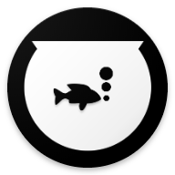

# Hi there, I'm Dankyi Anno Kwaku 

## I’m a Full Stack Software Developer
- 📚 You can view some of my projects on    <a href="https://apps.apple.com/vg/developer/fishpot-company-limited/id1430795812"> or 
- 💪🏼 I ran a digital technology company called FishPot Company Limited. <a href="https://company.fishpott.com">View FishPot Company.</a>
- I believe you will find our core service (in the making) exciting.  <a href="https://github.com/kadankyi1/fishpott_android">Read more about FishPott: Socio-commerce networking</a>

---

### Languages and Skills 🛠 

